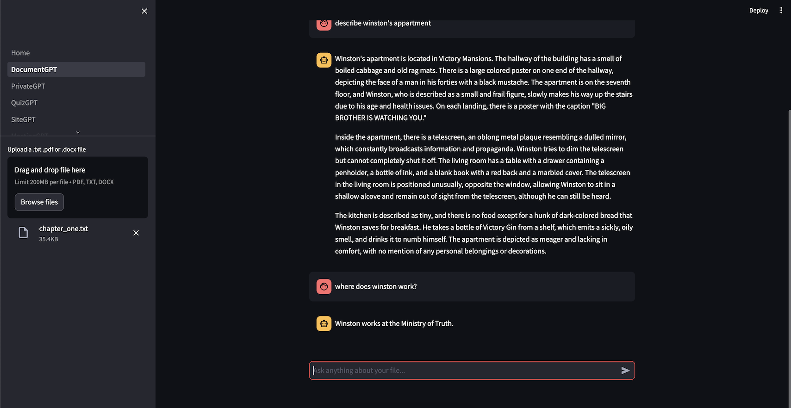

# 7. Document GPT
## 7.0 Introduction
streamlit: create UI from python code
## 7.1 Magic
보통 .write 함수를 써서 안에 있는 내용을 화면에 표시하는데, 그냥 변수만 두어도 화면에 표시됨. 그치만 그냥 .write를 쓰자

streamlit 문서: https://docs.streamlit.io/

https://streamlit.io/components
## 7.2 Data Flow
streamlit은 사용자의 interaction에 의해 데이터가 바뀌면 파일 전체가 refresh됨. 전체가 다시 실행됨.
## 7.3 Multi Page
pages 폴더안에 있는 페이지 들을 sidebar에 표시함
## 7.4 Chat Messages
st.chat_message : chat 대화 형식으로 UI를 출력해 줌

st.session_state : session의 data를 보존해 줌
## 7.5 Recap
## 7.6 Uploading Documents
document upload(=다른 폴더에 저장 해 두고) embedding을 진행해서 embedding도 파일 별로 정리하기
## 7.7 Chat History
@st.cache_data: decorator, 함수 아래의 실행 내역이 같다면, 다시 실행하지 않음. embedding 함수에 붙여주면 embedding을 매번 하지 않게 되므로 시간과 돈을 절약

새로운 입력이 입력되면 그 내용을 session state에 저장하고, 그동안 입력된 chat history를 화면에 그린다.

document가 존재하는한 chat history를 유지하는데, file이 삭제되면 chat history도 초기화 해줌.
## 7.8 Chain
입력 받은 docment를 chain으로 구성해서 유저 질문에 따른 응답을 출력하기

  
## 7.9 Streaming
답변을 생성하는 동안 답변을 스트리밍 하도록 구현. 답변 생성될 때까지 무조건 기다리지 않도록.

callback handler에서 llm이 token을 생성할 때 마다 callback을 받는 함수가 있어서 이 함수를 이용하면 token을 받을 때 마다 화면에 뭔가 그리도록 할 수 있음.
## 7.10 Recap